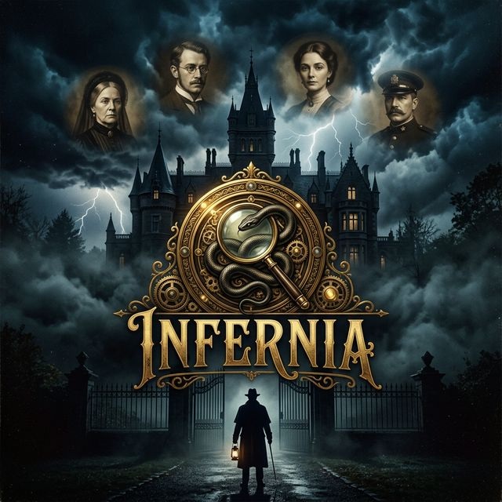

<div align="center">



# INFERNIA

**An AI murder mystery engine powered by formal logic.**

[](https://nextjs.org/)
[](https://www.typescriptlang.org/)
[](https://tailwindcss.com/)

[Live Demo](https://inferniaa.vercel.app) · [Academic Poster](/poster) · [Case Briefing](#-the-night-in-question) · [Architecture](#-architecture)
</div>

---

## The Night in Question

Isolated in the fog-bound moors of Victorian England sits **Blackwood Manor** — home to Lord Archibald Blackwood, a ruthless collector, swindler, and keeper of dangerous secrets. At midnight, amidst a torrential thunderstorm, Lord Blackwood is discovered dead. The murder weapon is missing. A window has been shattered from the inside. A single cryptic note is pinned to his chest:

> *"The Serpent has collected its debt."*

Stranded by the storm, four guests remain — each with a severe, undeniable motive. Scotland Yard has deployed an experimental analytical engine to untangle the web of alibis, motives, and physical constraints through pure mathematical logic.

## Features

- **Live Deduction Engine** — Watch the AI parse 12 overlapping forensic and testimonial constraints in real-time, validating hypotheses and backtracking when contradictions arise.
- **Interactive Field Investigation** — A 24×16 interactive canvas map where the AI investigator physically moves between rooms using A\* pathfinding to interrogate suspects and examine weapons.
- **Immersive Narrative UI** — A responsive Victorian dashboard featuring glassmorphism, dynamic typography, and suspenseful synchronized animations.
- **Algorithmic Transparency** — The engine actively explains *why* it makes decisions and how it prunes the search tree.

## Architecture

The simulation is built on three foundational AI techniques:

### Constraint Satisfaction Problem (CSP) Solver

The deduction engine maps the mystery to four categorical variables: **Suspect**, **Weapon**, **Room**, and **Time**.

| Property | Value |
|---|---|
| Variables | 4 (Suspect, Weapon, Room, Time) |
| Domain size | 4 values each → 256 initial configurations |
| Constraints | 12 unary, binary, and conditional rules |
| Strategy | Backtracking Search + Forward Checking |

Constraints are derived from witness testimonies and forensic evidence. Forward checking prunes impossible branches early — for example, ruling out 8 PM based on rigor mortis analysis.

### A\* Pathfinding

The investigator does not teleport. The manor is a formal 24×16 geometric grid containing walls, isolated wings, and bottlenecks.

- Uses **Manhattan Distance** as the heuristic
- Guarantees the shortest navigable path from the entrance to any target room
- Movement is animated on an HTML5 Canvas in real time

### Model-Based Reflex Agent (PEAS)

| Component | Description |
|---|---|
| **Performance** | Solve the case with certainty and minimum backtracks |
| **Environment** | Semantic clue domains + geometric manor layout |
| **Actuators** | Variable assignments, path traversal, UI state updates |
| **Sensors** | 12 natural-language constraints parsed into formal logic |

## The Suspects

| | Name | Alias | Motive |
|---|---|---|---|
| 👑 | Lady Eleanor Ashford | The Vengeful Widow | Vengeance for her husband's suspicious death |
| 📚 | Professor Alistair Thorn | The Disgraced Scholar | Ruined academic career and stolen research |
| 🕯️ | Miss Clara Whitmore | The Patient Governess | Stolen family inheritance |
| ⚔️ | Captain James Sterling | The Desperate Officer | Crippling gambling debts and blackmail |

## Tech Stack

| Layer | Technology |
|---|---|
| Framework | Next.js 16 (App Router) |
| Language | TypeScript 5 |
| Styling | Tailwind CSS v4 + custom CSS animations |
| Rendering | HTML5 Canvas API |
| Typography | Playfair Display, Inter, JetBrains Mono |

## Getting Started

**Prerequisites:** [Node.js](https://nodejs.org/) v18+

```bash
# Clone
git clone https://github.com/coderanik/Infernia.git
cd Infernia

# Install
npm install

# Run
npm run dev
```

Open [http://localhost:3000](http://localhost:3000) to initiate the protocol.

## Project Structure

```
├── app/
│   ├── page.tsx              # Landing page
│   ├── case-briefing/        # Narrative case briefing
│   ├── investigate/          # Main investigation dashboard
│   ├── story/                # Full story page
│   └── globals.css           # Theme & animations
├── components/
│   ├── CaseFile.tsx          # Suspect dossier cards
│   ├── ClueBoard.tsx         # Evidence constraint board
│   ├── MansionMap.tsx        # A* canvas visualization
│   ├── PEASTable.tsx         # Agent architecture table
│   ├── ReasoningLog.tsx      # Live deduction trace
│   └── SolutionReveal.tsx    # Final verdict reveal
├── lib/
│   ├── astar.ts              # A* pathfinding implementation
│   ├── clues.ts              # Constraint definitions
│   ├── constants.ts          # Domain values & suspect profiles
│   ├── csp.ts                # CSP solver with backtracking
│   ├── mansion.ts            # Grid layout & room geometry
│   └── types.ts              # TypeScript type definitions
```

## Credits

**Built with ❤️ by Anik, Yashi, and Tanvi.**

An academic AI exploration combining human-computer interaction, interactive storytelling, and formal logic execution.

---

<div align="center">
<sub>CSP Constraint Satisfaction · A* Pathfinding · Model-Based Reflex Agent</sub>
</div>
